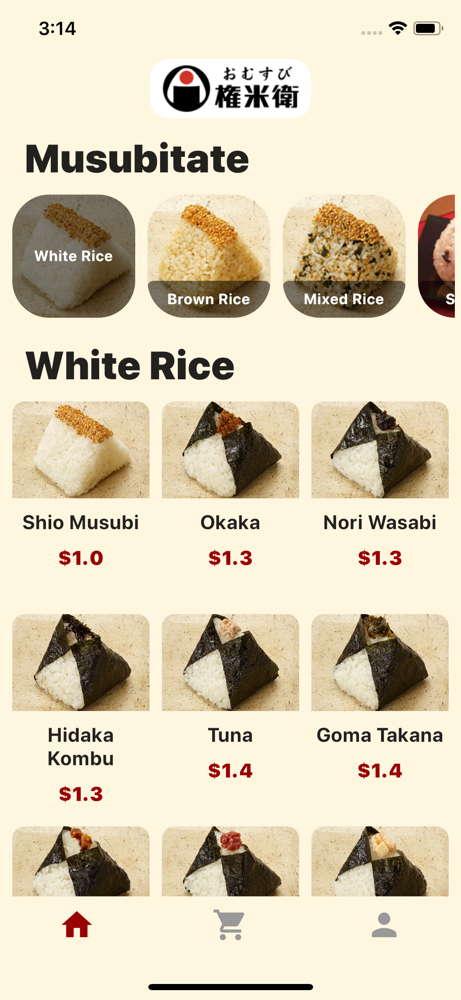
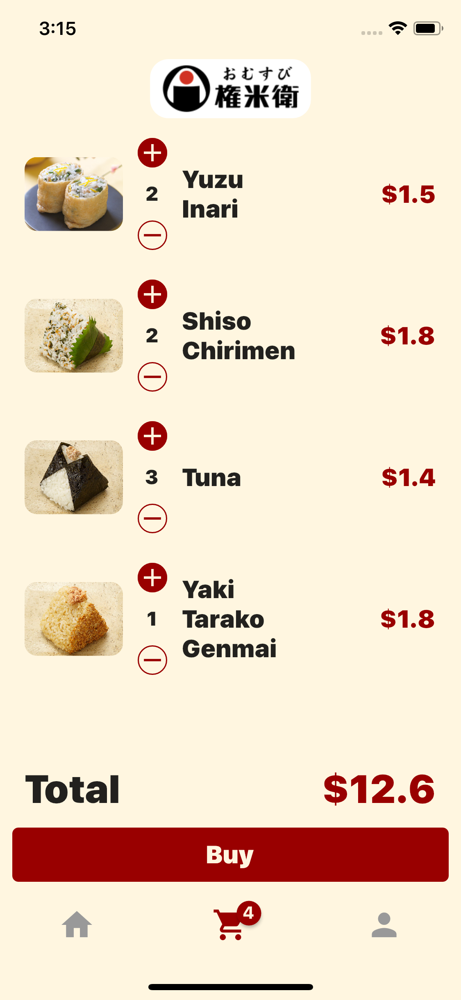
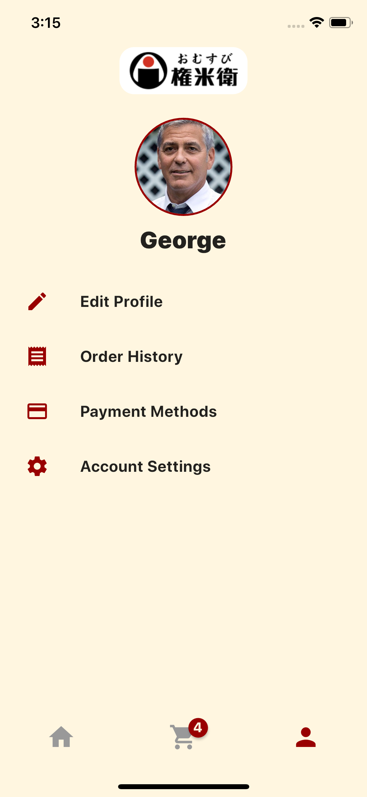
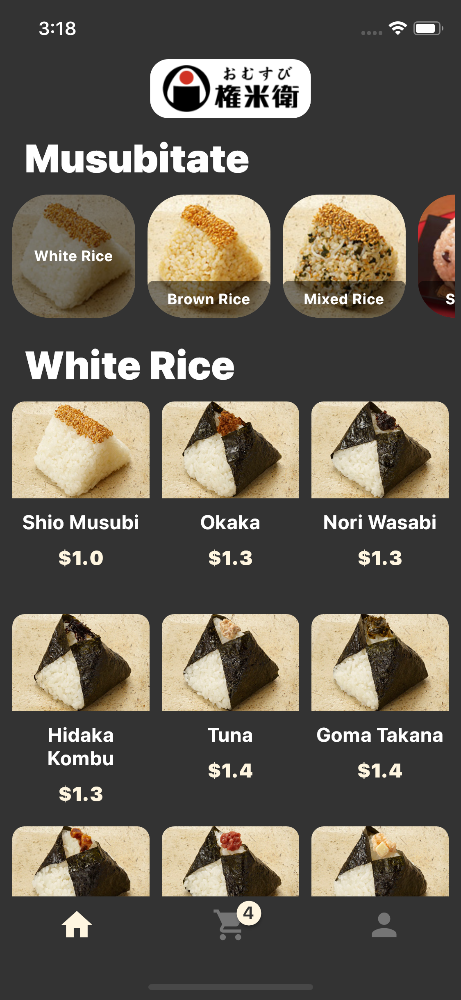
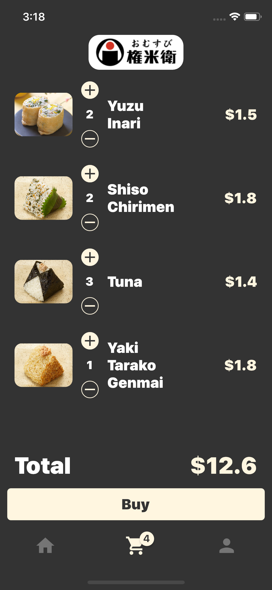
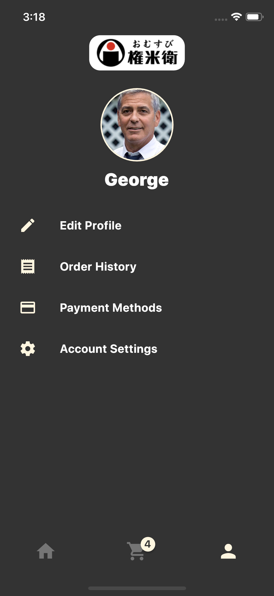
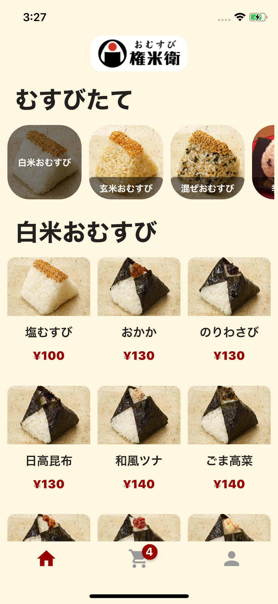
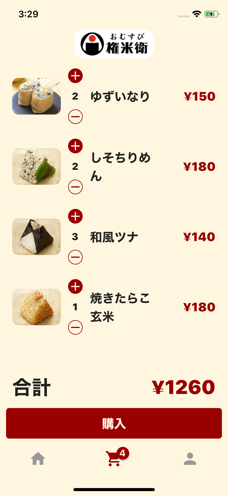
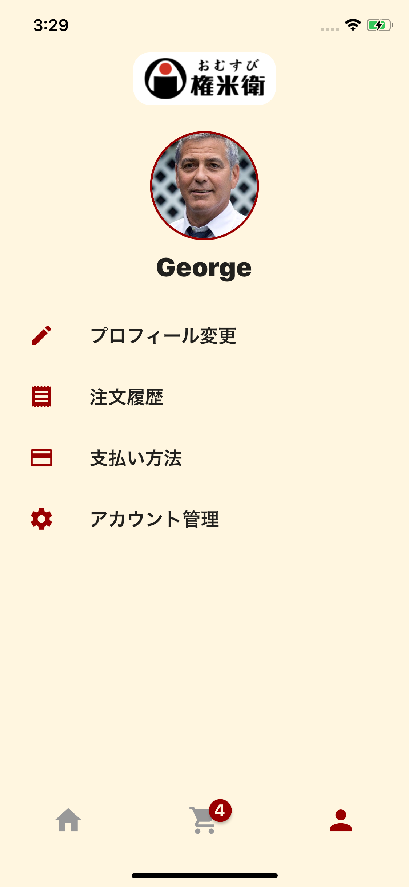

  

    
    <h1 align="center" style="font-size: 48px; font-weight: bold;">Omusubi Gonbei おむすび権兵衛</h1>
  

  <h2 align="center">An unofficial
    <a href="http://www.omusubi-gonbei.com/en/" target="_blank">Omusubi Gonbei</a>/
    <a href="http://www.omusubi-gonbei.com/" target="_blank">おむすび権兵衛</a>
  mobile order app build with Flutter & Firebase
  </h2>

  

    
  

---

## Screens

  

    
    
    
  

  

    
    
    
  

  

    
    
    
  

## Main Features

- List a variety of omusubis
- Authentication with email, Google, and Apple
- Payment with Credit Card
- Light Theme & Dark Theme
- Localization(only Japanese)

## Main Stack

- Flutter
- Provider with Bloc like architecture
- Firbase Auth for Authentication
- Firestore for persistent data
- Payment with Stripe and Cloud Functions
- Store profile picture with Cloud Storage

### About

This is a small personal project. Any comments and reactions would be awesome! Please check
[other projects](https://github.com/ykaito21/flutter_projects/blob/master/project_list.md) too.
